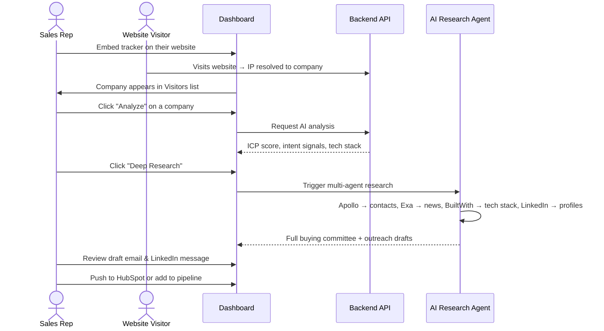
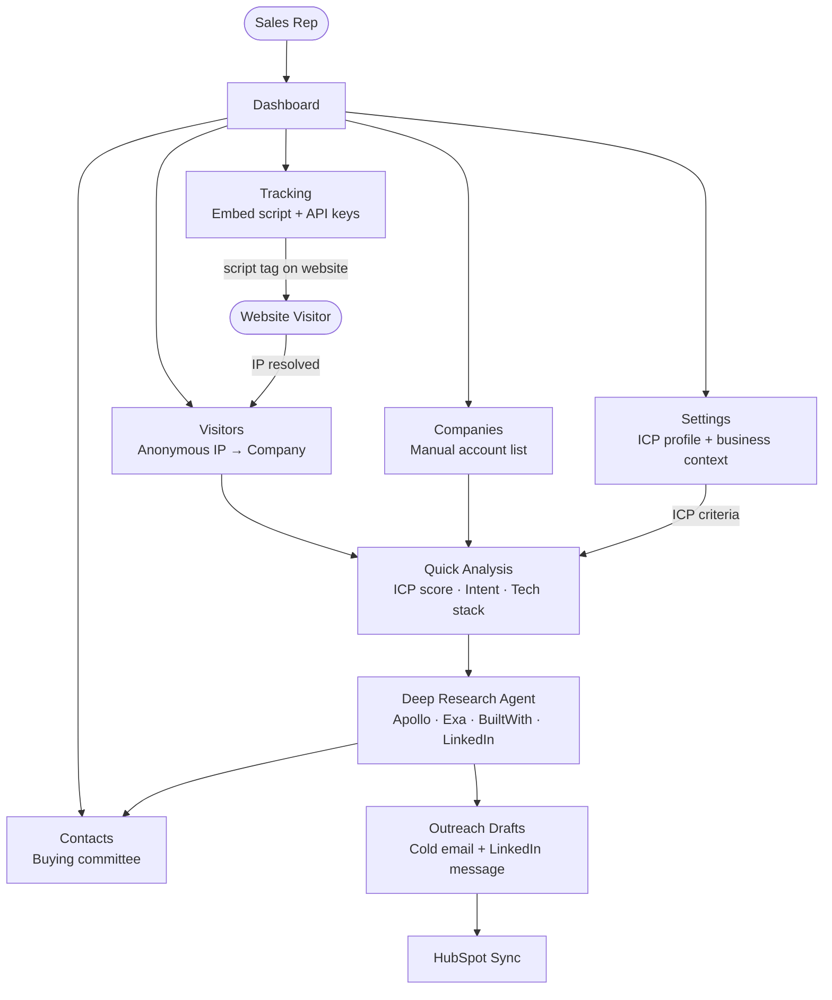

# LEPA — AI Account Intelligence & Enrichment

> **Sales teams are flying blind.** They know someone visited their website — but not who, not why, and not who to call. LEPA fixes that. It identifies anonymous visitors, researches the full buying committee using AI agents, and writes the first email — all without a human touching a keyboard.

---

## The Problem

B2B sales teams lose deals they never knew existed.

A company visits your pricing page three times this week. Your team has no idea. No name, no contact, no context. By the time someone manually researches the account, the moment has passed.

Existing tools either identify the company (but stop there) or require manual enrichment that takes hours. Nothing connects visitor identification → account research → contact discovery → personalized outreach in a single automated workflow.

**LEPA does all four — in under 2 minutes.**

---

## Live Demo

🔗 **[lepa-fello.vercel.app](https://lepa-fello.vercel.app)** — sign in with Google or email

---

## What It Does

### 1. Visitor Identification

A one-line script tag on any website. When someone visits, LEPA resolves their IP to a company in real time — no cookies, no PII, no consent issues.

```html
<script async src="https://cdn.lepa.ai/tracker.js?key=YOUR_KEY&endpoint=YOUR_API"></script>
```

### 2. AI Account Analysis

One click on any identified company triggers a full AI analysis:

- ICP fit score (0–100) against your defined ideal customer profile
- Intent signals — what the visit pattern suggests about buying stage
- Tech stack detection
- Recommended sales action with specific outreach angle

### 3. Deep Research Agent

A multi-agent pipeline that runs in parallel:


| Agent             | What it does                                      |
| ----------------- | ------------------------------------------------- |
| Apollo            | Pulls company data + contact list                 |
| Exa               | Finds recent news, funding rounds, hiring signals |
| BuiltWith         | Maps the full technology stack                    |
| LinkedIn scraping | Enriches each contact with profile data           |


Returns the full **buying committee** — names, titles, roles, LinkedIn profiles, and a specific engagement angle for each person.

### 4. Personalized Outreach Drafts

Generates a cold email and LinkedIn message for the top contact — using their actual name, their company's recent news, and your product's value proposition.

### 5. Pipeline + CRM

Stage-based pipeline (Research → Qualified → Engaged → Opportunity) with one-click HubSpot sync.

---

## Architecture







**Key design decisions:**

- **The research agent uses "Agents as Tools" — one orchestrator, four sub-agents.** Instead of a rigid pre-wired graph, Claude Sonnet acts as the orchestrator and decides which tools to call and in what order based on what it finds. If Apollo returns no contacts, it leans harder on LinkedIn. The pipeline adapts, it doesn't just execute.
- **The tracker authenticates via API key in the payload, not an auth header.** A script tag on a customer's website can't carry a JWT. So the tracker sends an API key in the POST body, the backend resolves it to a tenant, and the visitor is attributed correctly — all without exposing any credentials in the embed snippet.
- **All data sources within each tool run in parallel.** Inside each tool-agent, Apollo, Exa, BuiltWith, and the website scraper fire simultaneously via `asyncio.gather`. If any one fails, the others still return. A single slow API doesn't hold up the rest — and the total time is the slowest source, not the sum of all of them.

---

## Tech Stack


| Layer       | Technology                             | Why                                       |
| ----------- | -------------------------------------- | ----------------------------------------- |
| Frontend    | Next.js 16, TypeScript, Tailwind       | Fast, type-safe, Vercel-native            |
| Auth        | Clerk                                  | Multi-tenant JWT out of the box           |
| Backend     | FastAPI (Python)                       | Async, fast, easy agent integration       |
| AI Agent    | AWS Strands Agents + Claude 3.5 Sonnet | Native tool-use, parallel agent execution |
| Database    | PostgreSQL                             | Relational schema, ACID guarantees        |
| Tracker CDN | AWS S3 + CloudFront                    | Sub-50ms global delivery                  |
| Deployment  | Vercel + EC2 (t2.small)                | Frontend on edge, backend persistent      |


---

## What Makes This Different

Most sales intelligence tools are **lookup tools** — you give them a domain, they return a contact list. LEPA is a **workflow** — it watches your traffic, decides what's worth researching, runs the research autonomously, and hands your rep a ready-to-send email.

The gap we close: **from anonymous visit to personalized outreach in one click, with no manual work.**

---

## Challenges We Solved

**Reps spend 4+ hours a day on research, not selling.** Before LEPA, a sales rep who saw an interesting company visit their site would spend hours manually searching LinkedIn, reading news articles, guessing who to contact, and writing a cold email from scratch. Most gave up before sending anything. LEPA compresses that entire process into one click.

**Anonymous traffic is invisible pipeline.** 98% of website visitors leave without filling a form. That's not just lost leads — it's lost context. You don't know which companies are evaluating you, how often they're coming back, or what pages they care about. LEPA makes that invisible traffic visible and actionable.

**Personalization at scale is impossible manually.** Generic cold emails get ignored. Personalized ones get replies. But writing a truly personalized email — referencing the prospect's recent funding round, their tech stack, their specific role — takes 30 minutes per contact. LEPA does it in seconds, for every contact in the buying committee.

**Sales teams don't know who the real decision-makers are.** Even when reps find the right company, they often reach out to the wrong person. LEPA maps the full buying committee — economic buyer, champion, technical evaluator — and tells you exactly who to contact first and what angle to use.

---

## Roadmap

- Slack / Teams alerts when a target account visits
- Sequence automation — auto-enroll identified accounts into outreach sequences
- Lookalike scoring — find accounts similar to your best customers
- Native Salesforce + Pipedrive sync

---

## Local Setup

```bash
# Backend
cd lepa-backend && python -m venv venv && source venv/bin/activate
pip install -r requirements.txt && cp .env.example .env
uvicorn main:app --port 8000 --reload

# Agent
cd lepa-agent && uvicorn server:app --port 8001 --reload

# Frontend
cd lepa && npm install && cp .env.example .env.local
npm run dev
```

**Required API keys:** Apollo, Exa, BuiltWith, IPInfo, Clerk, AWS (S3 + CloudFront)

---

## Environment Variables

```bash
# Backend
NEON_DATABASE_URL=        # PostgreSQL connection string
APOLLO_API_KEY=
EXA_API_KEY=
BUILTWITH_API_KEY=
IPINFO_TOKEN=             # IP → company resolution
AWS_ACCESS_KEY_ID=
AWS_SECRET_ACCESS_KEY=

# Frontend
NEXT_PUBLIC_CLERK_PUBLISHABLE_KEY=
CLERK_SECRET_KEY=
NEXT_PUBLIC_API_URL=/api-proxy
NEXT_PUBLIC_AGENT_URL=/agent-proxy
```

---

